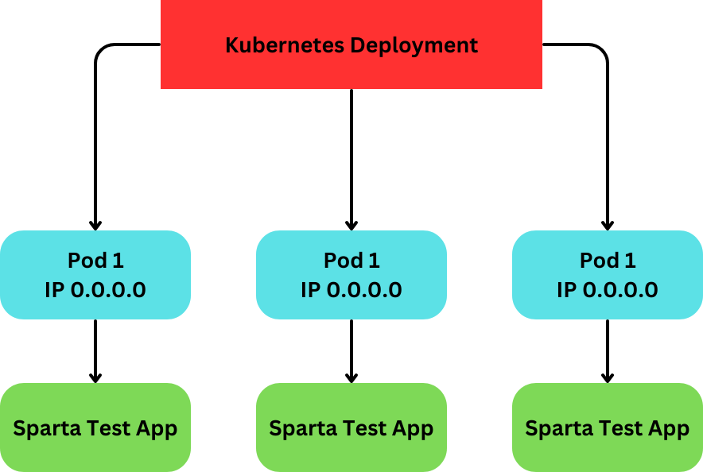

# Docker

### What is Docker?

- Docker is a set of platform as a service products that use OS-level virtualization to deliver software in packages called containers.

### What are the benefits to using Docker?

- The biggest benefit of Docker is its ability to isolate the development and production systems for your applications.

### Why use Docker?

- Docker is popular because it offers portability, consistency, and scalability for deploying applications in different environments. Docker containers are lightweight, isolated, and easy to deploy, making them a popular choice for modern application development and deployment.

# K8

### What is K8?

- Kubernetes, a powerful tool used to manage and orchestrate containers (like virtualized machines) on a large scale. It simplifies deployment, scaling, and management of software applications. It is also open source.

### Why K8?

- It helps us efficiently manage multiple applications on one server. It does this by dividing them into virtual machines, which keeps them isolated and secure.

- Kubernetes lets you use many Virtual Machines (VMs) on one server's CPU. The VMs keep apps separate, boosting security since one app can't freely access another's info.

### 5 Benefits to KB

- Open-Source
- Automation of deployment and scalability
- More portability with less chance of vendor lock-in
- Cost savings
- Increased DevOps efficiency for microservices architecture

### K8 Architecture Diagram


With Kubernetes you can deploy the app into multiple containers, this is similar to how you can deploy the app on multiple virtual machines however, with this you can have them all running on the same machine and operating system so they can all run on the same CPU. However, because they are all in sepereate containers they can't directly connect with each other providing security.


https://kubernetes.io/docs/concepts/overview/
- This page provides a great overview on the architectural structure of using Kubernetes comparied to other methods as well as explaining what it is and why to use K8.


## Commands for Docker
```
docker run -d -p 80:80 nginx # Starts a new container 
# -d stands for detached mode
# -p which port
# 80:80 (port to use : port to replace)

docker ps # Shows the containers running
docker images # Shows a list of the images

docker stop <id> # Stops the specified container
docker start <id> # Starts the specified container

docker rmi 9c7a54a9a43c -f
rmi (remove image)
-f (force)

docker exec -it be5610a85479 sh
(docker execute interactive <container id> shell)
```
Find the Index file inside the container
```
apt install sudo
apt update -y
apt upgrade -y
cd /usr
cd share
cd nginx
cd html
cat index.html
apt install nano
sudo nano index.html
```
## How to build an image on Docker
https://devopscube.com/build-docker-image/

1. Set up file and folder structure
```
mkdir nginx-image && cd nginx-image
mkdir files
touch .dockerignore
```
2. Create an index.html file and fill out the page
```
cd files
nano index.html
```
```html
<html>
  <head>
    <title>Dockerfile</title>
  </head>
  <body>
    <div class="container">
      <h1>My App</h1>
      <h2>This is my first app</h2>
      <p>Hello everyone, This is running via Docker container</p>
    </div>
  </body>
</html>
```
3. Create a default file in files folder
```
nano default
```

```
server {
    listen 80 default_server;
    listen [::]:80 default_server;
    
    root /usr/share/nginx/html;
    index index.html index.htm;

    server_name _;
    location / {
        try_files $uri $uri/ =404;
    }
}
```
4. In nginx-image folder create a Dockerfile and add content
```
cd ..
nano Dockerfile
```
```
FROM ubuntu:18.04  
LABEL maintainer="personalemail@dockerhub.com" 
RUN  apt-get -y update && apt-get -y install nginx
COPY files/default /etc/nginx/sites-available/default #local path to default / instance path to default
COPY files/index.html /usr/share/nginx/html/index.html #local path to index.html / instance path to index.html
EXPOSE 80 #port
CMD ["/usr/sbin/nginx", "-g", "daemon off;"]
```
```
# Alternative Dockerfile option 
# from which image
FROM nginx

# what to copy into the container from localhost - index.html
COPY files/index.html /usr/share/nginx/html/

# port 80
EXPOSE 80

# CMD specific instructions
CMD ["nginx", "-g", "daemon off;"]
```
5. Build the docker image (same folder as Dockerfile file)
```
docker build -t nginx_build:v1
```
6. Optional - test the image
```
docker images
docker run -d -p 81:80 nginx_build:v1
docker ps
```
7. Log into docker
```
docker login
```
8. Tag image with docker username
```
docker tag nginx_build:v1 lpweller/nginx_build:v1
```
9. Push to dockerhub
```
docker push lpweller/nginx_build:v1
```


ahskhan/node-deploy-k8:v2 3000:3000

Take the given image provided, run the app, build your own image from this and push to dockerhub. Make notes on the steps you have taken Complete by 15:30

by C.O.B Microservice images of app and db


Blocker: 
- When attempting to run a container, it closes automatically. (Fixed)
  - Add `sleep infinity` to the end of run command